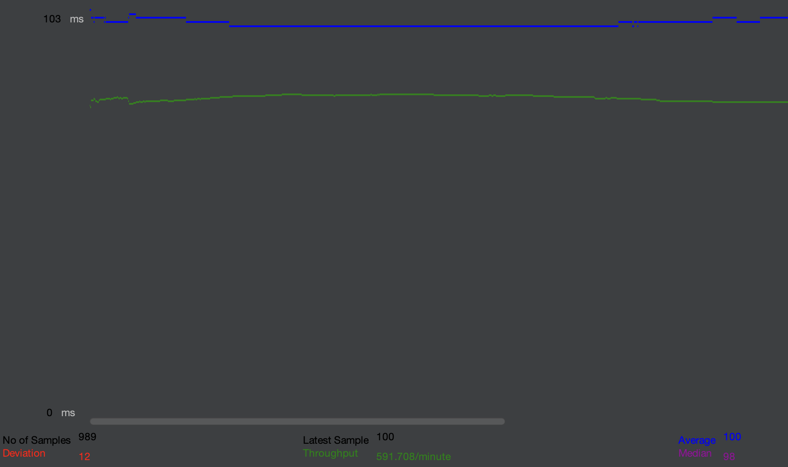
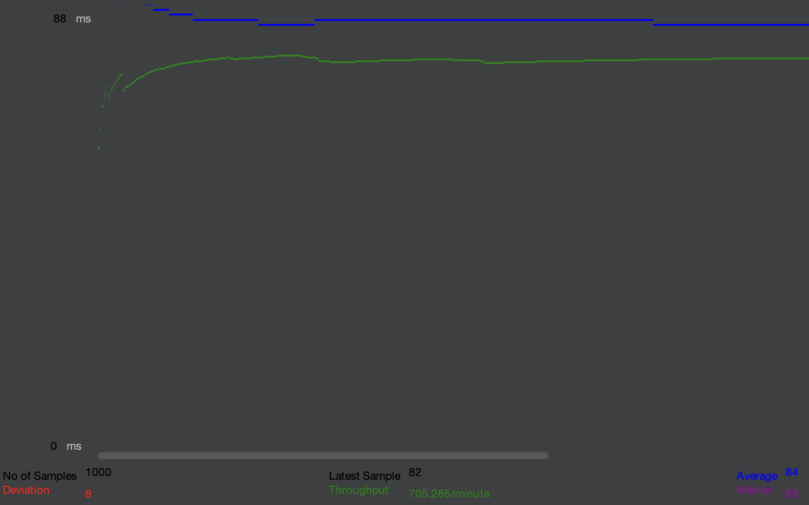
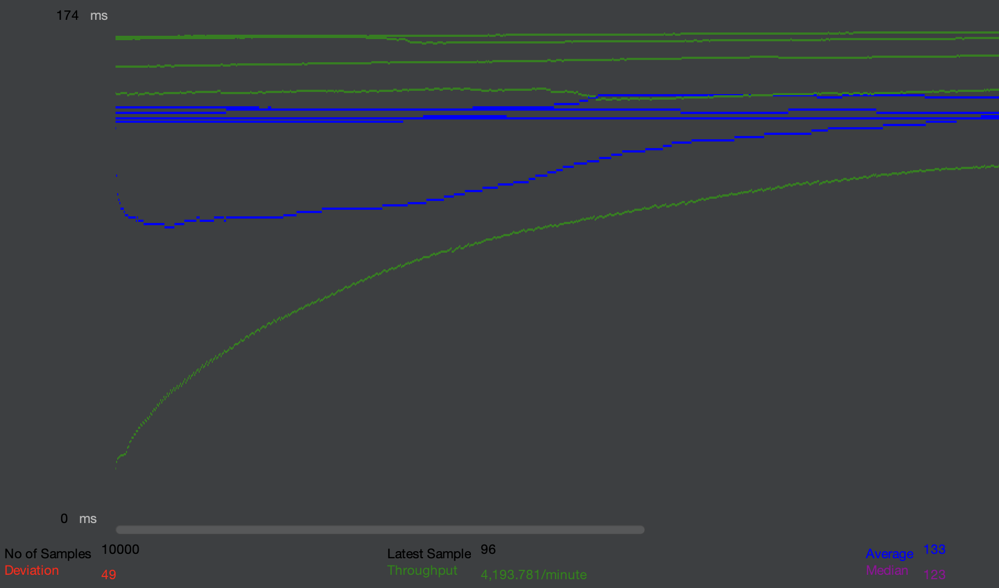
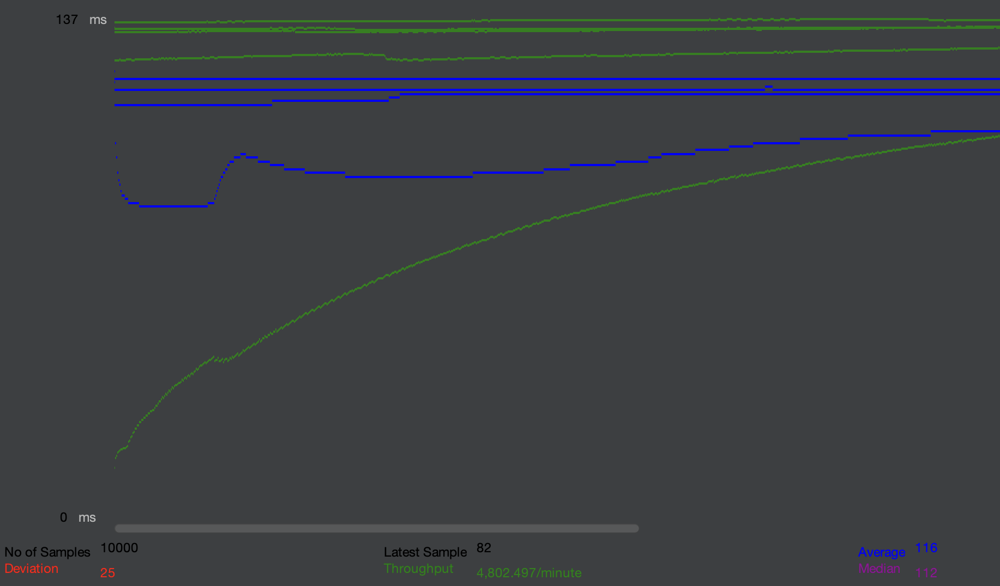
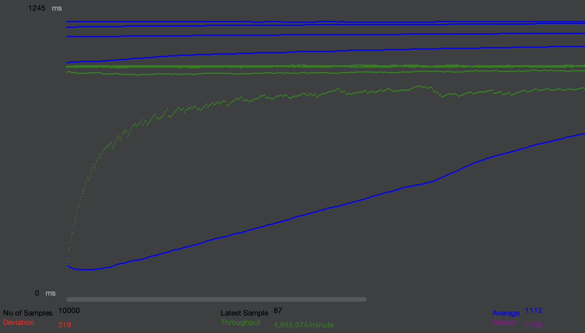
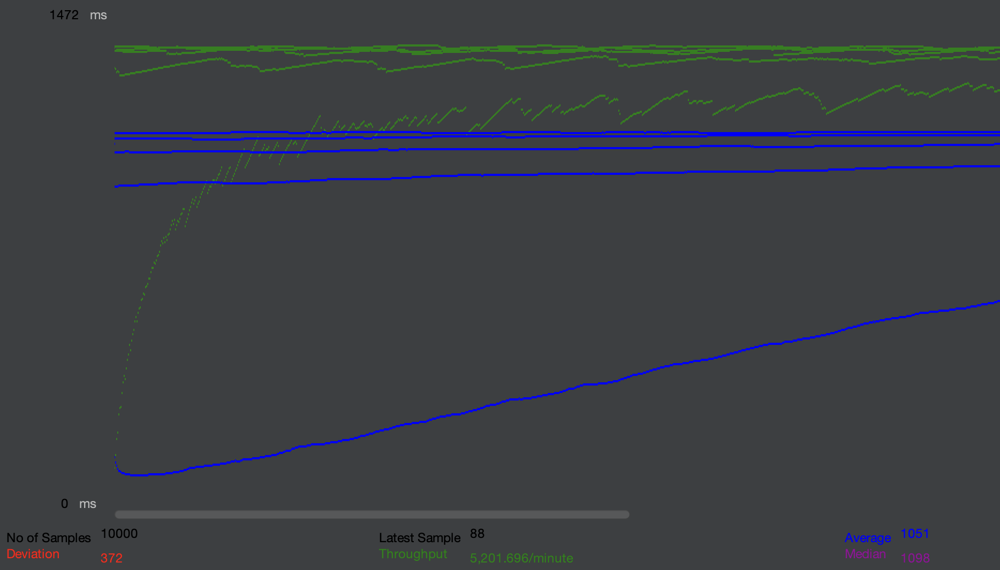
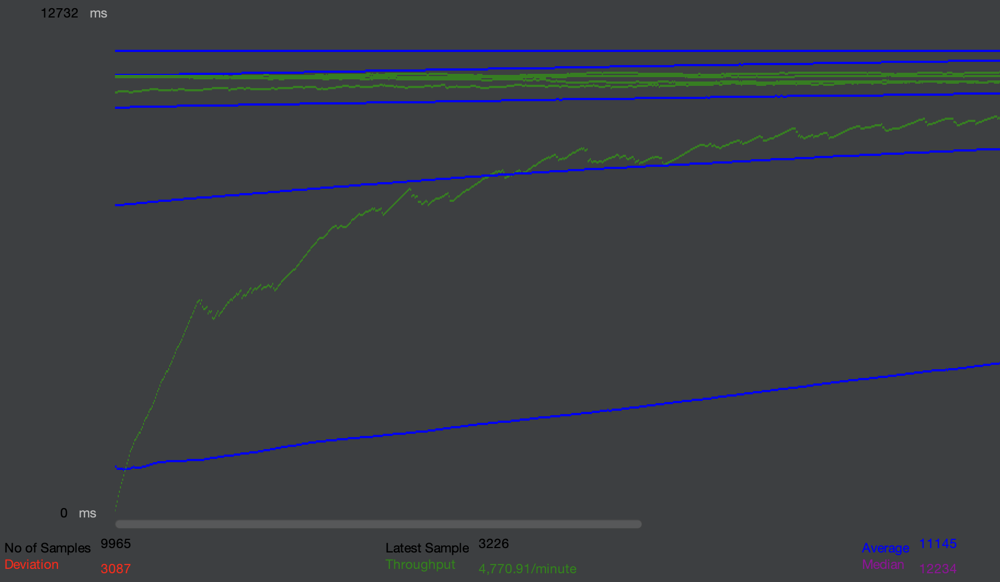
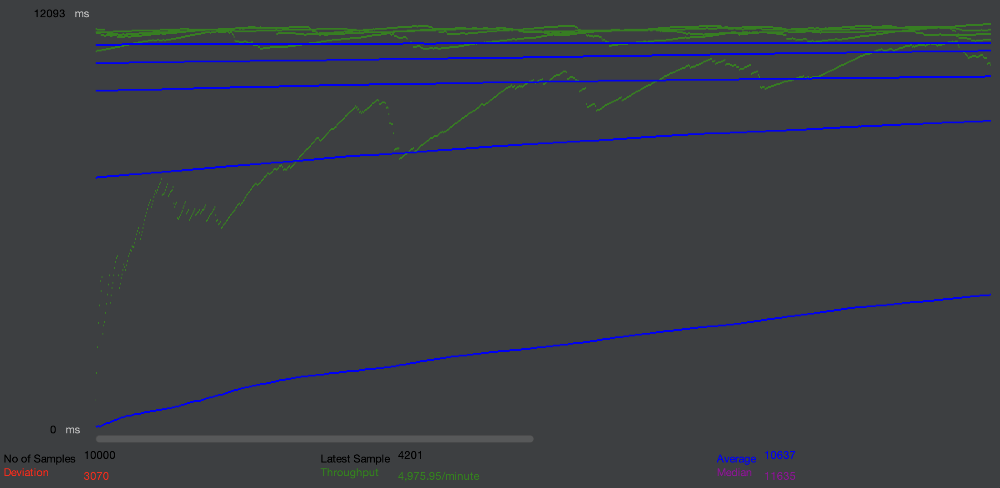
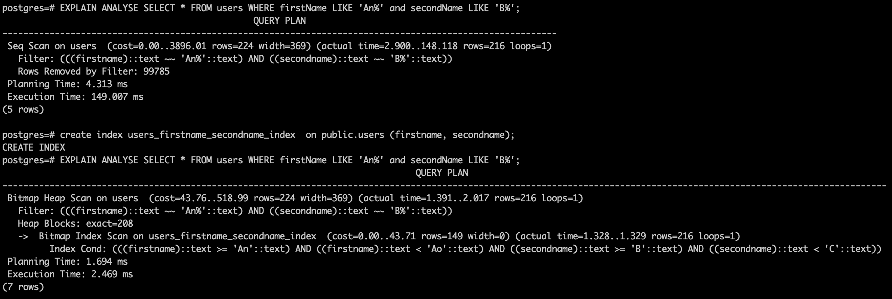

| Threads | Without index                               | With index                               |
|---------|---------------------------------------------|------------------------------------------|
| 1       |     |     |
| 10      |    |    |
| 100     |   |   |
| 1000    |  |  |

```postgresql
CREATE INDEX users_firstname_secondname_index ON public.users (firstName, secondName);

EXPLAIN ANALYSE SELECT * FROM users WHERE firstName LIKE 'An%' and secondName LIKE 'B%';
```



B-Tree позволяет осуществлять многоколоночный поиск